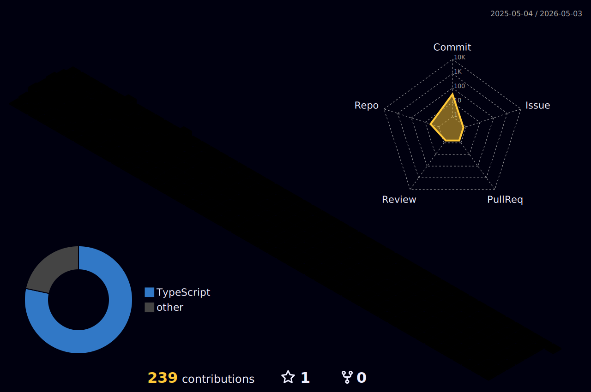

## Alessandra Romualdo

<!--  -->

   <h4>Currently pursuing a degree in Analysis and Systems Development, I am expanding my skills to become a Full Stack Developer </h4>
   <h4>Fullstack Developer from Sete Lagoas-MG, Brazil. My first "Hello World" was with HTML, CSS and JavaScript languages.
   </h4>
   <h4>Since 2022, I have been studying to transition my career to the technology field.
   </h4>
   <h4>Passionate about games and technology, some of my hobbies are games, watching series and movies, and doing survival game lives</h4>

## Languages and tools

|  |  |
| ----------- | ----------- |
   
  <!-- 

      
      
      
      
      
      
      
      
          
   
-->

<!-- ## Tools

 

   
   
   
   

 -->

## Contato

   

   

  

  
<!--  -->

   

   
 Visitantes</b>

  
  
   
  

  
  

  
  
